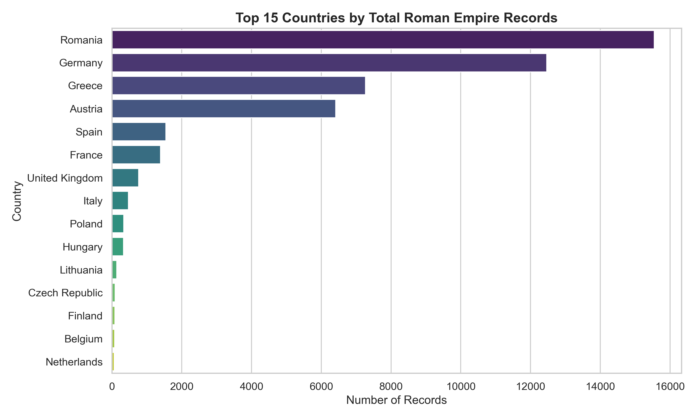
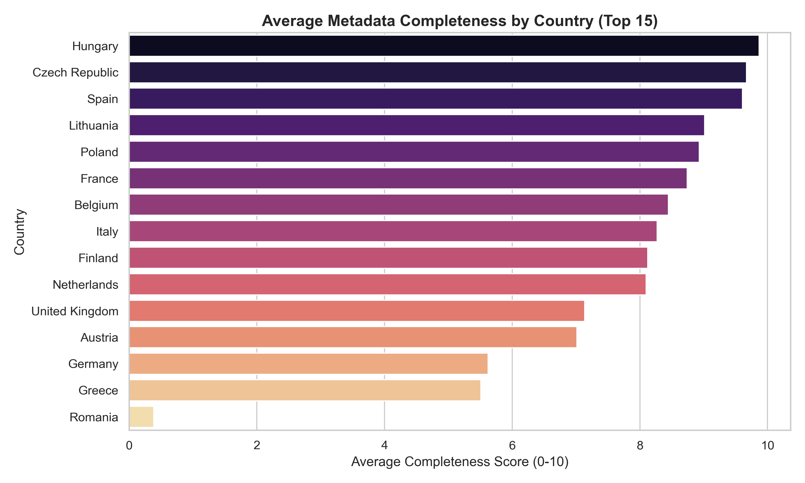
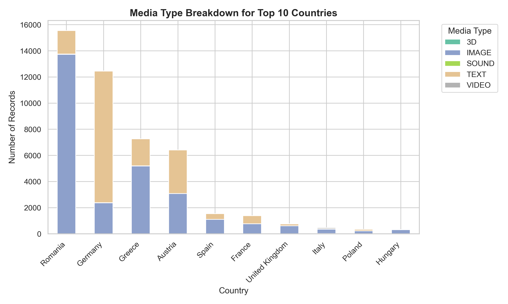
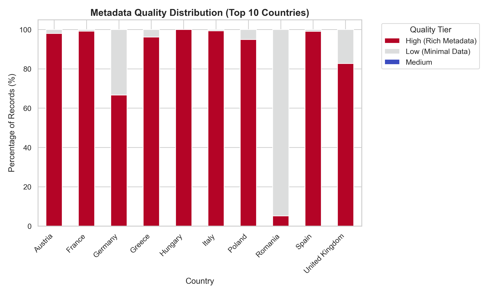

# Frontiers of Memory: A Data Geography Analysis of Roman Imperial Heritage

## 1. Introduction
When museums and libraries put their historical artifacts online, the result is rarely perfectly balanced. This project looks at how the Roman Empire is digitally remembered and preserved today. By looking at data from Europeana—a massive European online cultural heritage platform—this project asks a simple question: Which modern countries and museums hold the most digital records of the Roman Empire, and how good is the information they provide? 

By analyzing this data, we can see clear patterns in which countries have the resources to digitize their history and how much effort they put into adding detailed descriptions to those files.

## 2. How the Project Was Built
To make sure this project is transparent and easy for anyone to recreate, the entire process is organized into a simple, automated workflow.

### Setup and Downloading the Data
The project runs on a single Python script (`01_reproducible_workflow.ipynb`). When you run it, the code automatically connects to the Europeana website and searches for anything tagged with "Roman Empire." It loops through the results and downloads 47,157 raw records, saving them safely in the `data/raw/` folder. Everything you need to run the code is listed in a `requirements.txt` file so anyone can set it up easily on their own computer.

### Cleaning and Organizing
The raw data downloaded from Europeana was very messy and had over 600 columns, many of which were completely empty. The code filters this down to just 9 useful columns and saves the clean version to the `data/processed/` folder. 

During this step, the code also creates two new, helpful columns:
* **Quality Category:** Europeana gives each item a "completeness" score from 0 to 10 based on how much information the museum filled out. The code groups these numbers into simple labels: `low` (0-3), `medium` (4-6), and `high` (7-10).
* **Short Title:** Some items had massive text names that slowed down the computer, so the code created a `title_short` column to keep things running fast and smoothly.

## 3. Visual Analysis: What the Data Shows

### 3.1 Total Volume: Who Has the Most Records?

*Observation:* This chart looks at which countries have uploaded the highest number of digital records. It shows a clear imbalance. A small number of countries dominate the database with tens of thousands of records, while others have very few. This highlights that the digital history of the Roman Empire online is heavily shaped by just a few specific national archives that upload in bulk.

### 3.2 Average Quality: Quantity vs. Quality

*Observation:* Having the most records does not mean having the best records. This chart shows the average "completeness" score for different countries. Often, the countries that upload the highest volume of items have very low average scores. On the other hand, some countries that upload fewer items have nearly perfect scores. This suggests some museums focus on carefully detailing a few items, while others just mass-upload files with empty information boxes.

### 3.3 Media Types: Mostly Just Pictures

*Observation:* This chart breaks down the type of files being uploaded (like text, images, or 3D models). Despite advances in technology, there is almost no 3D or video content. The digital preservation of the Roman Empire is still overwhelmingly just 2D flat images and digitized text documents.

### 3.4 The Ratio of Good Data to Minimal Data

*Observation:* Using our custom `quality_category` (low, medium, high), this chart shows what percentage of a country's uploads are actually detailed. It proves that massive datasets are sometimes mostly "low" quality (missing basic historical context). Meanwhile, other countries provide almost exclusively "high" quality data, showing that good online history relies on careful museum curation, not just uploading as many files as possible.

## 4. Ethics and Limitations
It is important to know the limits of this data. Because we are looking at how museums fill out digital forms, there are a few blind spots:
* **Coverage Bias:** We only have data from museums that actively partner with Europeana. Museums outside of Western Europe, or those with less funding for digital projects, are missing from this picture.
* **Search Term Bias:** The code only downloaded items that included the exact English phrase "Roman Empire." If a museum tagged an item in a different language or used a specific regional term, it was left out.
* **What "Completeness" Means:** Europeana’s completeness score only measures if a text box was filled in, not if the history is actually accurate or good. A high score just means the museum filled out the form completely.
* **The "Year" Problem:** The `year` column is very messy. Instead of listing the actual historical age of the artifact (like 100 AD), many museums accidentally typed in the year they took the digital photo or uploaded the file (like 2006). Because of this, we cannot use the data to sort artifacts by historical time periods.

## 5. Conclusion
This project successfully maps out who controls the digital memory of the Roman Empire on Europeana. The data proves that online historical archives are deeply affected by the habits of the museums that use them. There is a clear divide between mass-digitization (uploading thousands of poorly labeled images) and careful curation (uploading fewer, but highly detailed records). Ultimately, the quality of our digital history depends entirely on the humans typing in the metadata.
